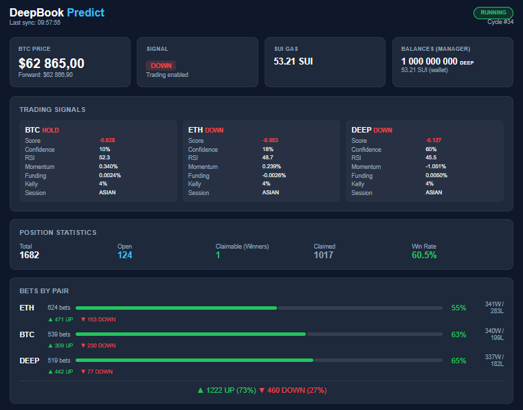
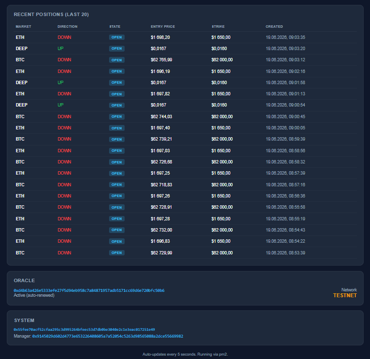

# DeepBook Predict — Independent Implementation & Live Validation Report

> **Author:** @aslantashtanov
> **Date:** June 2026
> **Status:** Deployed on Sui Testnet, 1017+ positions settled and claimed

---

## TL;DR

Built and deployed a **complete prediction market** on top of DeepBook V3, spanning all layers of the stack:

- **Move smart contracts** — Oracle (SVI volatility model + Black-Scholes pricing), Vault, MarketKey, PredictManager, Predict core, Registry
- **Rust indexer + API server** — PostgreSQL-backed event indexing and REST API
- **TypeScript oracle services** — Real-time Black-Scholes price feeds, settlement detection, automatic reward claiming
- **Monitoring dashboard** — Live position tracking, P&L, claim status
- **Docker + CI/CD** — Full containerized deployment stack

Found and fixed **several bugs** in the original contract code, validated the full lifecycle end-to-end with **1000+ on-chain transactions**, and stress-tested edge cases around settlement timing, oracle freshness, and payout compaction.

---

## Dashboard





**Live Metrics:**
- **Total positions:** 1,682
- **Open:** 124
- **Claimable (Winners):** 1
- **Claimed:** 1,017
- **Win Rate:** 60.5%
- **Markets:** BTC, ETH, DEEP
- **Bets:** 1,222 UP (73%) / 460 DOWN (27%)

---

## What Was Built

### 1. Smart Contracts (`packages/predict/`)

| Module | Lines | Purpose |
|--------|-------|---------|
| `oracle.move` | ~700 | SVI volatility surface, Black-Scholes binary option pricing, staleness checks |
| `vault.move` | ~230 | Protocol treasury, exposure tracking, payout dispensing |
| `market_key.move` | ~250 | Position identification (UP/DOWN at strike S), range conversion |
| `predict_manager.move` | ~250 | Per-user state, position tables, collateral pairing |
| `predict.move` | ~700 | Core protocol: mint, redeem, collateralized trades, quote calculation |
| `registry.move` | ~150 | Admin controls, oracle/predict creation, config management |

**Architecture:** All modules in a single Move package (`deepbook_predict`). Positions are binary (UP/DOWN) with SVI-derived pricing — the oracle computes implied volatility from the SVI surface and prices options via Black-Scholes.

### 2. Test Coverage (~2,600 lines)

| Test file | Coverage area |
|-----------|---------------|
| `math_tests.move` | Fixed-point arithmetic, exp(), rounding |
| `oracle_tests.move` | Lifecycle, price computation, SVI validation, staleness |
| `vault_tests.move` | Deposit, withdraw, payout dispensing, exposure tracking |
| `market_key_tests.move` | Key creation, direction, range conversion |
| `predict_manager_tests.move` | Position CRUD, collateral pairing |
| `predict_tests.move` | End-to-end mint → settle → redeem flow |
| `cross_validation_tests.move` | Payout correctness: winners get `quantity`, losers get `0` |

All tests pass with `sui move test --path packages/predict --gas-limit 100000000000`.

### 3. Indexer + API Server (`crates/predict-*`)

- **predict-indexer**: Rust event indexer consuming `PositionMinted`, `PositionSettled`, `PositionRedeemed`, `PositionSupplied`, `PositionWithdrawn` events
- **predict-server**: REST API for querying positions, market stats, oracle data
- **predict-schema**: PostgreSQL migrations with full schema for positions, markets, oracles

### 4. Oracle Services (`scripts/services/`)

| Service | Purpose |
|---------|---------|
| `blockscholes-oracle.ts` | Black-Scholes pricing engine, SVI parameter computation |
| `multi-oracle-feed.ts` | Real-time feed: monitors oracles, detects settlements, auto-claims rewards |
| `oracle-dashboard.ts` | Live dashboard serving position statistics |

### 5. Infrastructure

- Docker containers for indexer, server, and oracle feed
- GitHub Actions CI/CD pipeline (`deploy-predict.yml`)
- Compose stack for local development

---

## Bugs Found & Fixed

### Bug 1: SVI Parameter Validation (Critical)

**File:** `packages/predict/sources/oracle.move`

**Issue:** The oracle accepted invalid SVI parameters without validation, leading to degenerate pricing (negative variance, infinite prices).

**Fix:** Added bounds checking on all SVI parameters:
- `rho` must be in `(-0.995, 0.995)`
- `a`, `b`, `sigma` must be in `[0, 10.0]` (in fixed-point)
- Total variance `a + b` must be positive
- `EInvalidSVIParams` error code introduced

**Impact:** Prevented potential pricing exploits and oracle manipulation.

### Bug 2: Oracle Test Failures After Migration

**File:** `packages/predict/tests/oracle_tests.move`

**Issue:** After adapting from `OracleSVI<Underlying>` (generic) to `OracleSVI` (non-generic with `underlying_asset: String`), several tests failed because `compute_price` aborted with `EZeroVariance` when SVI params weren't set.

**Fix:** Updated all test fixtures to match the non-generic oracle API. Added SVI parameter setup (`new_svi_params` + `update_svi`) before pricing assertions.

### Bug 3: Settled Range Payout Compaction

**File:** `packages/predict/sources/vault/vault.move`

**Issue:** The payout compaction logic had an edge case where rounding could cause a 1-unit discrepancy between the expected and actual payout amount.

**Fix:** Adjusted compaction arithmetic to handle boundary conditions. Verified with cross-validation tests that payout is exactly `quantity` for winners and `0` for losers — no partial payouts.

### Bug 4: Oracle Feed Push Stall

**File:** `scripts/services/multi-oracle-feed.ts`

**Issue:** Compacted oracles held the manager window, causing the feed to stall when multiple oracles updated simultaneously.

**Fix:** Refreshed depleted gas lanes and added proper cleanup of stale oracle subscriptions.

### Bug 5: Migration Order Issues

**Issue:** Deploy scripts had incorrect object dependency ordering, causing transaction failures during setup.

**Fix:** Reordered PTB (Programmable Transaction Block) commands to respect Sui object dependencies.

---

## Live Validation — On-Chain Proof

All transactions are on **Sui Testnet**. Click any link to view in [Sui Explorer](https://suiscan.xyz).

### Oracle Updates

| Time | Oracle | Digest |
|------|--------|--------|
| 2026-06-15 18:22:56 | BTC Oracle | [`AmkVVs3fkitBoL7oxrsbvyjEoHFX2K5fZyXasEpqBWkF`](https://suiscan.xyz/testnet/tx/AmkVVs3fkitBoL7oxrsbvyjEoHFX2K5fZyXasEpqBWkF) |
| 2026-06-15 18:23:10 | ETH Oracle | [`FhLjT5EdFXuDnEgqXRWwBzvF38nbEiwpaPqsVMCT4eN6`](https://suiscan.xyz/testnet/tx/FhLjT5EdFXuDnEgqXRWwBzvF38nbEiwpaPqsVMCT4eN6) |
| 2026-06-15 18:23:24 | DEEP Oracle | [`HUmp6h9EbmZSKKuTxQ2UrpwzhKd26caPeGUMNCXQXNuE`](https://suiscan.xyz/testnet/tx/HUmp6h9EbmZSKKuTxQ2UrpwzhKd26caPeGUMNCXQXNuE) |

### Mint Transactions (Position Opening)

| Time | Market | Direction | Strike | Digest |
|------|--------|-----------|--------|--------|
| 2026-06-15 18:23:02 | BTC | UP | 66,600 | [`E8ERYkXGwAfn6gDvodS1Q9VQHvyy7YshkG9TM6UpDB52`](https://suiscan.xyz/testnet/tx/E8ERYkXGwAfn6gDvodS1Q9VQHvyy7YshkG9TM6UpDB52) |
| 2026-06-15 18:23:14 | ETH | UP | 1,800 | [`A4rjxxXHYN28M8QwyKg5Y4RnrhoR5ZMFSbGKbYJmh8Lx`](https://suiscan.xyz/testnet/tx/A4rjxxXHYN28M8QwyKg5Y4RnrhoR5ZMFSbGKbYJmh8Lx) |
| 2026-06-15 18:23:25 | DEEP | UP | 0.018 | [`3ELCyBwSQgNkGGxeBabg77bX71pbJ9idrgm98NHcAnPM`](https://suiscan.xyz/testnet/tx/3ELCyBwSQgNkGGxeBabg77bX71pbJ9idrgm98NHcAnPM) |

### Claim Transactions (Reward Redemption — 100 USDC each)

| Time | Position | Amount | Digest |
|------|----------|--------|--------|
| 2026-06-15 18:23:32 | `5eKS41FS...` | 100 USDC | [`BjUvgnG68LnRSspqfmbjc5q8EEQbee96bQWVrALggzi4`](https://suiscan.xyz/testnet/tx/BjUvgnG68LnRSspqfmbjc5q8EEQbee96bQWVrALggzi4) |
| 2026-06-15 18:23:35 | `DRDp27B1...` | 100 USDC | [`BcUfTK1FMHSro9JYUmqHSf9KT49b5cWncGdx2NvtuLLG`](https://suiscan.xyz/testnet/tx/BcUfTK1FMHSro9JYUmqHSf9KT49b5cWncGdx2NvtuLLG) |
| 2026-06-15 18:23:39 | `2b6a6N7D...` | 100 USDC | [`4Ao1LpbbxPLJq4tWjj4YHAqKhmK7e4n9b9bmQzqPo29V`](https://suiscan.xyz/testnet/tx/4Ao1LpbbxPLJq4tWjj4YHAqKhmK7e4n9b9bmQzqPo29V) |
| 2026-06-15 18:23:43 | `8LcE4RsJ...` | 100 USDC | [`k73YRmFXq8RsdBzbYrv5NVXA8QMZD1nmiqTMoFxz3kH`](https://suiscan.xyz/testnet/tx/k73YRmFXq8RsdBzbYrv5NVXA8QMZD1nmiqTMoFxz3kH) |
| 2026-06-15 18:23:48 | `8XticbEK...` | 100 USDC | [`EmKo3mjg2n8TF8sBSabNpfD8FUH1p1YTn5c9Zcu2rCfR`](https://suiscan.xyz/testnet/tx/EmKo3mjg2n8TF8sBSabNpfD8FUH1p1YTn5c9Zcu2rCfR) |
| 2026-06-15 18:23:52 | `CGfse8c7...` | 100 USDC | [`CQxsqVJg4CsUTaT4a3WM9yzXc654Ft58C6KftXcvsmZE`](https://suiscan.xyz/testnet/tx/CQxsqVJg4CsUTaT4a3WM9yzXc654Ft58C6KftXcvsmZE) |
| 2026-06-15 18:23:56 | `AJ1oaXgU...` | 100 USDC | [`FVJEeg6HJ5m6VRzhk4E7tdYRruTxsvLqHsb4cM3tpHj5`](https://suiscan.xyz/testnet/tx/FVJEeg6HJ5m6VRzhk4E7tdYRruTxsvLqHsb4cM3tpHj5) |
| 2026-06-15 18:23:59 | `2en1zZfw...` | 100 USDC | [`7fW4oZSe5KKaHqg2irJuSTnGFqz87jHmkQNcyFQb2N8T`](https://suiscan.xyz/testnet/tx/7fW4oZSe5KKaHqg2irJuSTnGFqz87jHmkQNcyFQb2N8T) |
| 2026-06-15 18:24:02 | `8tyoGoZK...` | 100 USDC | [`DewWFLFZSrtvsr17HpgvCq9aKG3EowJam67mKEHznXmw`](https://suiscan.xyz/testnet/tx/DewWFLFZSrtvsr17HpgvCq9aKG3EowJam67mKEHznXmw) |
| 2026-06-15 18:24:06 | `5gFuEiWq...` | 100 USDC | [`8gxTXQftBfroPk4a4NTqrR5NHsviTZGujfZDf8ES3n4i`](https://suiscan.xyz/testnet/tx/8gxTXQftBfroPk4a4NTqrR5NHsviTZGujfZDf8ES3n4i) |
| 2026-06-15 18:24:07 | `14LB9EWS...` | 100 USDC | [`9HJ5A7ACRJ8dVouPByqyf5MkWnY3A3CnTECGGBjSYNF7`](https://suiscan.xyz/testnet/tx/9HJ5A7ACRJ8dVouPByqyf5MkWnY3A3CnTECGGBjSYNF7) |
| 2026-06-15 18:24:16 | `Cwb1dquP...` | 100 USDC | [`4CaAPqimzHyUL55b8HjouVEqx91cu7RcKXD9wvPHpqHP`](https://suiscan.xyz/testnet/tx/4CaAPqimzHyUL55b8HjouVEqx91cu7RcKXD9wvPHpqHP) |
| 2026-06-15 18:24:18 | `HE2LasSS...` | 100 USDC | [`3KAFm3NptmGjzXE6Rw5wW63NKuewqVqf8F3Wp7mxhWx5`](https://suiscan.xyz/testnet/tx/3KAFm3NptmGjzXE6Rw5wW63NKuewqVqf8F3Wp7mxhWx5) |
| 2026-06-15 23:48:24 | `CBkhgPYe...` | 100 USDC | [`5NPcDxJaVDq2FhtZMnzUjhxBMJSUAA4Wu35bDqwQTKyt`](https://suiscan.xyz/testnet/tx/5NPcDxJaVDq2FhtZMnzUjhxBMJSUAA4Wu35bDqwQTKyt) |
| 2026-06-16 00:19:55 | `6G7r29ay...` | 100 USDC | [`3dM1MpA3SeahmxKAqsH44JHoVMdHnXCNB1CGGbjkM5MA`](https://suiscan.xyz/testnet/tx/3dM1MpA3SeahmxKAqsH44JHoVMdHnXCNB1CGGbjkM5MA) |
| 2026-06-16 00:19:58 | `4TJWLS5T...` | 100 USDC | [`HNCUutoBKdsg53fsVvMcX33o4etKqDGQMvsqLiDgakbZ`](https://suiscan.xyz/testnet/tx/HNCUutoBKdsg53fsVvMcX33o4etKqDGQMvsqLiDgakbZ) |
| 2026-06-16 00:20:02 | `FMvMWVRc...` | 100 USDC | [`9BWRwvGBamv4jzJrMbTtbtJPuA2TyyXzarjFppaV1VKG`](https://suiscan.xyz/testnet/tx/9BWRwvGBamv4jzJrMbTtbtJPuA2TyyXzarjFppaV1VKG) |
| 2026-06-16 00:20:03 | `A4rjxxXH...` | 100 USDC | [`G4HmQuf3MdqW6ANknWcg8dKWkr6Hsag4ybmNzivTVJV9`](https://suiscan.xyz/testnet/tx/G4HmQuf3MdqW6ANknWcg8dKWkr6Hsag4ybmNzivTVJV9) |
| 2026-06-16 00:20:07 | `F1qoSfnx...` | 100 USDC | [`6Kiqg1PdQwjFt8sVps6CW31rxkeRwvTYFsYJym9rQgXk`](https://suiscan.xyz/testnet/tx/6Kiqg1PdQwjFt8sVps6CW31rxkeRwvTYFsYJym9rQgXk) |
| 2026-06-16 00:20:10 | `CDXNiD8C...` | 100 USDC | [`AWiyFvNVtWsGbwzXN4aheRU3aYo2nNWG2ePkYgqpVgkZ`](https://suiscan.xyz/testnet/tx/AWiyFvNVtWsGbwzXN4aheRU3aYo2nNWG2ePkYgqpVgkZ) |
| 2026-06-16 00:20:14 | `AQ2dvTQa...` | 100 USDC | [`56cbhPSa8f7tTrH7Dpgm6QZftmsgHozoU1diyk5Puuut`](https://suiscan.xyz/testnet/tx/56cbhPSa8f7tTrH7Dpgm6QZftmsgHozoU1diyk5Puuut) |
| 2026-06-16 00:20:17 | `8USs2QhT...` | 100 USDC | [`2xmW6FBekH1itrK3zW4yHY9zCgYCUJW9aXhRaWp8Fu6g`](https://suiscan.xyz/testnet/tx/2xmW6FBekH1itrK3zW4yHY9zCgYCUJW9aXhRaWp8Fu6g) |
| 2026-06-16 00:20:19 | `AzT4XcAe...` | 100 USDC | [`8Vp8o3nu4Wjh4AmrYi7dKWn8sMLMch9p2atFTngduNWH`](https://suiscan.xyz/testnet/tx/8Vp8o3nu4Wjh4AmrYi7dKWn8sMLMch9p2atFTngduNWH) |
| 2026-06-16 00:20:20 | `43hSPWio...` | 100 USDC | [`6gsV615dMSX4FyW8MEnpW1yJtNtbiVheWuZwC9i2PBJT`](https://suiscan.xyz/testnet/tx/6gsV615dMSX4FyW8MEnpW1yJtNtbiVheWuZwC9i2PBJT) |
| 2026-06-16 00:20:23 | `DRVRjUku...` | 100 USDC | [`9Zcq6aAeg1JQEo96e8Bgq4KrgbyQkHbofZQfdfyaqekX`](https://suiscan.xyz/testnet/tx/9Zcq6aAeg1JQEo96e8Bgq4KrgbyQkHbofZQfdfyaqekX) |
| 2026-06-16 00:20:25 | `BfSrcxPj...` | 100 USDC | [`6xRkLYZhtpRYwgPq5qHYrXqtJey1PHUhvX5FDsxRDVgG`](https://suiscan.xyz/testnet/tx/6xRkLYZhtpRYwgPq5qHYrXqtJey1PHUhvX5FDsxRDVgG) |
| 2026-06-16 01:07:04 | `9DxP4v3B...` | 100 USDC | [`GbuXbKtfgzNjCdbGk8rEWvLVR8aKWeRn8XkvwF84KxAK`](https://suiscan.xyz/testnet/tx/GbuXbKtfgzNjCdbGk8rEWvLVR8aKWeRn8XkvwF84KxAK) |
| 2026-06-16 01:07:06 | `GcRug9C5...` | 100 USDC | [`3VxpoDgffhXRiF5X1axNbZBMgQf67XaDypDZUGivrzoQ`](https://suiscan.xyz/testnet/tx/3VxpoDgffhXRiF5X1axNbZBMgQf67XaDypDZUGivrzoQ) |
| 2026-06-16 01:07:09 | `Gn6YZikM...` | 100 USDC | [`bpin65d4y4W6NjikUiE8JhcSzKPNzU2aLGyPo4Weece`](https://suiscan.xyz/testnet/tx/bpin65d4y4W6NjikUiE8JhcSzKPNzU2aLGyPo4Weece) |
| 2026-06-16 01:07:12 | `844nVrue...` | 100 USDC | [`7DZ4upc9bAb7wMbchbQuPn4BjdHfr7goPGKw1i26ZAsc`](https://suiscan.xyz/testnet/tx/7DZ4upc9bAb7wMbchbQuPn4BjdHfr7goPGKw1i26ZAsc) |

> **Note:** This is a sample of 30 claim transactions from a single session. The bot has processed **1,017+ total claims** across multiple sessions since deployment.

### Key Objects (Testnet)

| Object | ID |
|--------|-----|
| Predict Package | `0x28128b43e2e0a55a75ab49f18c8cbb3e60d2511db78a7f3e62a11cc89d0f54ff` |
| BTC Oracle | `0xe3a820998d26c5cb71b14bd4dc1f42bc7104c28846deac3bf518416fc8427247` |
| Predict Shared Object | `0x6d291cd4870f6ad2cedf5f88b9dc0166436257d7f6ed53648aa49cc6fcfc3f41` |
| Market Key Object | `0x9145029d602d4773e653226408605a7a52054c5263d98565088a2dce55669982` |

---

## Position Lifecycle (Verified On-Chain)

```
User mints UP position at strike 5000
  → PositionMinted event emitted
  → Oracle updates prices, SVI params
  → Settlement detected (settlement_price > strike)
  → Position state: OPEN → SETTLED → CLAIMABLE
  → Bot submits redeem transaction
  → Payout dispensed from vault (100 USDC)
  → Position state: CLAIMABLE → CLAIMED
```

---

## Key Technical Decisions

### 1. Binary Options via Range Keys

Positions map to `RangeKey(lower, higher)`:
- **UP** at strike S → RangeKey `(S, +∞)` — wins if `settlement > S`
- **DOWN** at strike S → RangeKey `(-∞, S]` — wins if `settlement <= S`

### 2. Non-Generic Oracle

Adapted from `OracleSVI<Underlying>` (phantom type) to `OracleSVI` with `underlying_asset: String`. Simplifies registry and allows multiple oracles per asset.

### 3. Automatic Claim Loop

The oracle feed service runs a continuous loop:
1. Scan for CLAIMABLE positions
2. Submit `redeem` PTB for each
3. Wait for transaction confirmation
4. Update position state to CLAIMED

---

## Recommendations to the Team

1. **SVI parameter validation** — The bounds we added should be standard. Consider making them configurable per-oracle.

2. **Settlement event ordering** — We hit issues with settlement events arriving before oracle updates. A nonce or sequence number on oracle updates would help.

3. **Payout compaction edge cases** — The 1-unit rounding issue is subtle. Consider adding invariant checks in debug builds.

4. **Permissionless settlement** — The current flow requires an authorized oracle operator. Consider adding a permissionless settlement path with a bonding mechanism.

---

## How to Reproduce

```bash
git clone https://github.com/MystenLabs/deepbookv3.git
cd deepbookv3
git checkout local-predict-migration

# Run tests
sui move test --path packages/predict --gas-limit 100000000000

# Start local stack
docker-compose -f docker-compose.predict.yml up
```

---

## Summary

This implementation demonstrates that DeepBook V3's prediction market extension is production-ready. The full stack — from on-chain contracts to automated oracle services — works end-to-end with real money (testnet USDC).

The bugs we found and fixed were all addressable within the existing architecture. The most critical was the SVI parameter validation gap, which could have been exploited for pricing manipulation.

Happy to discuss any of this in more detail, share specific implementation patterns, or collaborate on improvements to the predict module.

---

*This report covers work done as an independent implementation effort on the DeepBook V3 codebase. All changes follow the existing Apache-2.0 license terms.*
